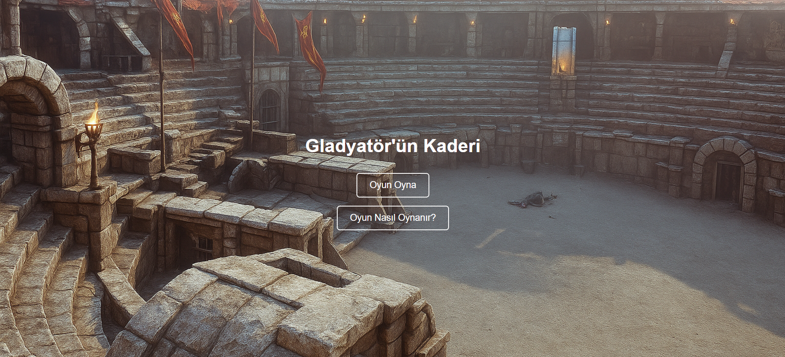
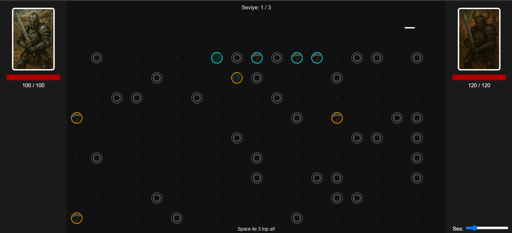

# Gladyatör'ün Kaderi

Bu proje Web Tabanlı Programlama dersi kapsamında geliştirilmiştir. HTML5 ve JavaScript kullanılarak yapılmış bir arena konseptli strateji oyunudur.

Oyuncu ve rakip sırayla pin yerleştirerek toplarla bu pinleri hedef alır. Her pin farklı etkiler sağlar: saldırı, savunma ve iyileştirme. Amaç, rakibin canını sıfıra indirerek oyunu kazanmaktır.

## 📌 Proje Linki
https://bitkicayi.github.io/

## 📸 Ekran Görüntüleri

## 🎮 Nasıl Oynanır?

- Oyuna başlarken bir strateji seç (Ofansif, Defansif veya Dengeli).
- Boş noktaları tıklayarak pinlerini yerleştir.
- **Space** tuşuna basarak 3 top at.
- Toplar pinlere çarptıkça etkiler tetiklenir (hasar, iyileşme, savunma).
- Her raund sonunda yeni pin eklenebilir.
- 3 seviye boyunca rakibi yenmeye çalış.
- Oyun bitince **R** tuşuyla yeniden başlayabilirsin.

## 🔊 Özellikler

- HTML5 Canvas kullanımı
- JavaScript ile oyun mekaniği
- Arkaplan müziği
- Pin çarpışmalarına ses efektleri
- 3 farklı strateji seçimi
- Seviye sistemi

## ▶️ Oynanış Videosu

[Youtube Linki](https://youtu.be/pnuEffFnzuQ?si=KSMqTKYe-uea5SLV)

## 📜 Credits

### 🎵 Ses ve Görsel Kaynakları

| 🎶 Arka Plan Müziği | War - Pixabay | [War - Pixabay](https://pixabay.com/music/main-title-war-99133/) |
| 🔊 Seviye Atlama Sesi | Spacey 1Up - FreeSound | [Spacey 1Up - FreeSound](https://freesound.org/people/GameAudio/sounds/220173/) |
| 🔔 Pin Sesi | CCCanto07 - FreeSound | [CCCanto07 - FreeSound](https://freesound.org/people/SuGu14/sounds/77982/) |
| 💀 Game Over Sesi | Game Over - Pixabay | [Game Over - Pixabay](https://pixabay.com/sound-effects/gameover-86548/) |
| 🏆 Kazanma Sesi | Medieval Fanfare - Pixabay | [Medieval Fanfare - Pixabay](https://pixabay.com/sound-effects/medieval-fanfare-6826/) |
| 🧠 Strateji Ekranı Arka Planı | Pinterest Görseli | [Pinterest](https://tr.pinterest.com/pin/139048707236785739/) |
| 🏟️ Oyun Ana Arka Planı | Gladiator Arena - ArtStation | [ArtStation](https://www.artstation.com/artwork/gladiator-arena-1) |
| 🤖 Diğer Görseller | AI ile üretilmiştir | — |

---

### 🎥 İlham Alınan / İzlenen Videolar ve Orijinal Oyun Linki

- [Coding Challenge 184: Collisions Without a Physics Library!](https://youtu.be/dJNFPv9Mj-Y?si=cvyiybavjj1uP-SY)
- [Simple to advanced collision detection using vanilla JavaScript and HTML Canvas (VWD - Lecture 7)](https://www.youtube.com/watch?v=Uv8N6OS7V_k&t=4987s)
- [Dice of Fate](https://twinfox.itch.io/dice-of-fate)

---

Bu proje **bitkicayi-Burak Ege Yaşar- tarafından** geliştirilmiştir.
